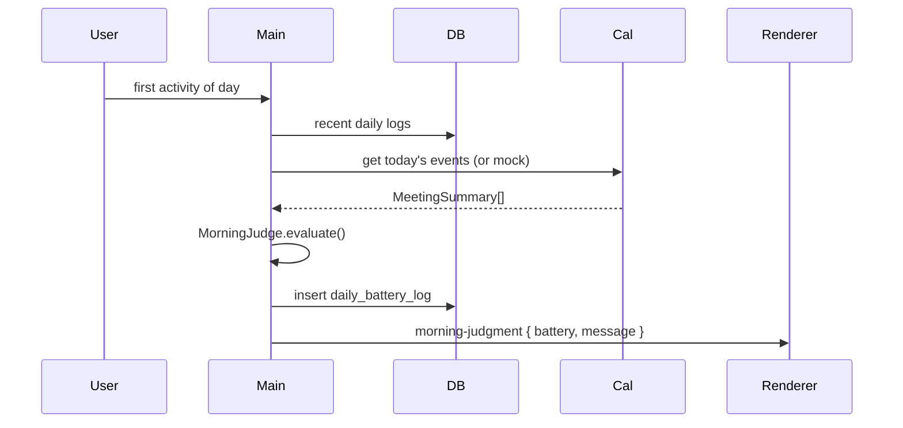
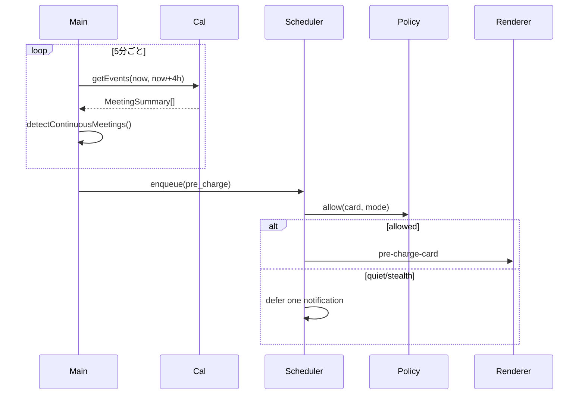
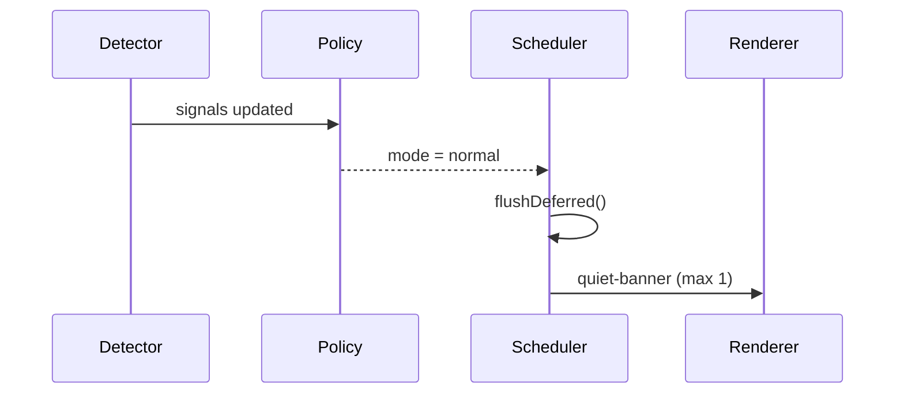

# PowerPal アプリケーション設計書

**ドキュメント種別**: Application Design Specification
**バージョン**: 1.1
**最終更新**: 2026-05-10
**関連文書**: `../requirements/requirements.md`, `../user-stories/stories.md`, `../user-stories/personas.md`

---

## 1. アーキテクチャ概要

### 1.1 全体構成

PowerPal は Electron をベースとした 3 層構成のデスクトップアプリケーションである。

```text
┌──────────────────────────────────────────────────────────────┐
│ Renderer Process (React + TypeScript)                       │
│ Character UI / Cards / Settings / Onboarding                │
│  - UI 描画                                                  │
│  - ユーザー入力                                             │
│  - Main から渡された文言と状態の表示                        │
└───────────────────────────────┬──────────────────────────────┘
                                │ IPC (contextBridge)
┌───────────────────────────────┴──────────────────────────────┐
│ Main Process (Electron + Node.js)                            │
│ Battery / MorningJudge / Calendar / PreCharge                │
│ VisibilityDetector / DisplayPolicy / NotificationScheduler   │
│ ToneEngine / Persistence / OAuth / Tray                      │
└───────────────────────────────┬──────────────────────────────┘
                                │
        ┌───────────────────────┼──────────────────────┐
        ▼                       ▼                      ▼
 Google Calendar API       OS APIs               SQLite + Keychain
 (read-only)               (idle, window,        (local logs,
                           fullscreen, camera*)   settings, token)
```

\* カメラ使用は利用可能な OS シグナルがある場合のみ参照する。

### 1.2 主要設計決定

| 決定 | 理由 |
|---|---|
| Electron 採用 | デスクトップ常駐、最前面 UI、OS シグナル取得が必要 |
| React + TypeScript + Vite | UI の高速試作と型安全性 |
| `contextBridge` を必須化 | Renderer を untrusted とみなし、Node API を直接渡さない |
| ビジネスロジックを Main に集約 | Battery / tone / notification の二重実装を防ぐ |
| ToneEngine も Main 所有 | 文言生成を判定と同じ責務に置き、整合性を保つ |
| Visibility 判定を 2 段に分離 | `検知` と `表示可否` を分離し、誤検知時の挙動を安定させる |
| Core MVP は macOS 先行 | 工数を UI 体験に集中させるため |

### 1.3 プロセス境界の責任分担

| プロセス | 責任 |
|---|---|
| Main | 電池計算、朝判定、文言生成、活動検知、カレンダー取得、通知制御、永続化、OAuth、表示ポリシー |
| Renderer | UI 描画、ユーザー入力、簡易アニメーション、IPC イベント購読 |

**原則**:

- Renderer は **表示専用** に寄せる
- Main が生成した `state + message + allowedActions` を Renderer が描画する
- Renderer 側で独自に通知文言や判定条件を再計算しない

---

## 2. モジュール構成

### 2.1 ディレクトリ構造

```text
powerpal/
├── electron/
│   ├── main/
│   │   ├── index.ts
│   │   ├── window-manager.ts
│   │   ├── tray.ts
│   │   ├── ipc/
│   │   │   ├── battery.handler.ts
│   │   │   ├── calendar.handler.ts
│   │   │   ├── notification.handler.ts
│   │   │   └── settings.handler.ts
│   │   ├── domain/
│   │   │   ├── battery/
│   │   │   │   └── battery-engine.ts
│   │   │   ├── morning/
│   │   │   │   └── morning-judge.ts
│   │   │   ├── lottery/
│   │   │   │   └── lottery.ts
│   │   │   ├── precharge/
│   │   │   │   └── precharge-planner.ts
│   │   │   ├── tone/
│   │   │   │   ├── tone-engine.ts
│   │   │   │   └── templates.ts
│   │   │   ├── visibility/
│   │   │   │   ├── visibility-detector.ts
│   │   │   │   └── display-policy.ts
│   │   │   └── notification/
│   │   │       └── notification-scheduler.ts
│   │   ├── adapter/
│   │   │   ├── google-calendar.ts
│   │   │   ├── mock-calendar.ts
│   │   │   └── weather.ts
│   │   ├── persistence/
│   │   │   ├── db.ts
│   │   │   ├── repositories/
│   │   │   └── migrations/
│   │   └── security/
│   │       └── token-store.ts
│   └── preload/
│       └── index.ts
├── src/
│   ├── App.tsx
│   ├── main.tsx
│   ├── components/
│   │   ├── character/
│   │   │   ├── BatteryCharacter.tsx
│   │   │   ├── BatteryIcon.tsx
│   │   │   └── expressions/
│   │   ├── cards/
│   │   │   ├── MorningCard.tsx
│   │   │   ├── PreChargeCard.tsx
│   │   │   ├── QuietBanner.tsx
│   │   │   └── ForceChargeCard.tsx
│   │   ├── modal/
│   │   │   ├── LotteryModal.tsx
│   │   │   ├── SummaryModal.tsx
│   │   │   └── OnboardingModal.tsx
│   │   └── settings/
│   │       └── SettingsPanel.tsx
│   ├── stores/
│   │   ├── battery.store.ts
│   │   ├── notification.store.ts
│   │   └── settings.store.ts
│   ├── hooks/
│   │   └── useElectronEvent.ts
│   └── theme/
│       └── colors.ts
├── shared/
│   └── types/
│       ├── battery.ts
│       ├── ipc.ts
│       ├── notification.ts
│       └── settings.ts
└── package.json
```

### 2.2 主要モジュール責任

#### 2.2.1 Battery Engine

```typescript
interface BatteryEngine {
  getCurrent(): BatterySnapshot;
  tick(input: TickContext): BatterySnapshot;
  recover(action: ChargeAction): BatterySnapshot;
  adjustManual(value: number): BatterySnapshot;
  subscribe(listener: (snapshot: BatterySnapshot) => void): Unsubscribe;
}

interface BatterySnapshot {
  battery: number;
  tier: 'full' | 'fine' | 'normal' | 'caution' | 'danger';
  updatedAt: Date;
}
```

実装方針:

- 電池は 0-100 の整数で表示し、内部では float で誤差吸収する
- 減算は **アクティブ作業分だけ**に適用する
- 回復量は固定だが小さめに保ち、行動との体感整合性を優先する

#### 2.2.2 MorningJudge

```typescript
interface MorningJudge {
  evaluate(input: MorningInput): MorningResult;
}

interface MorningResult {
  battery: number;
  message: string;
  factors: MorningFactor[];
}
```

方針:

- 電池値の決定は deterministic に寄せる
- ランダム性は数値ではなく **文言選択** のみに使う
- `battery` は 35-90 に clamp し、毎朝の極端な揺れを避ける

アルゴリズム概要:

```typescript
function evaluate(input: MorningInput): MorningResult {
  let battery = 78;

  if (input.lastDayFinalBattery < 30) battery -= 10;
  else if (input.lastDayFinalBattery < 50) battery -= 5;

  if (input.lastDayEndHour >= 22) battery -= 10;
  else if (input.lastDayEndHour >= 20) battery -= 5;

  if (input.todayMeetingMinutes >= 240) battery -= 8;
  else if (input.todayMeetingMinutes >= 180) battery -= 4;

  if (input.todayContinuousMeetingCount >= 2) battery -= 8;
  else if (input.todayContinuousMeetingCount >= 1) battery -= 4;

  if (input.weather === 'rain') battery -= 3;
  if (input.weather === 'snow') battery -= 5;

  battery = clamp(battery, 35, 90);

  return {
    battery,
    message: toneEngine.morningLine(input, battery),
    factors: summarizeFactors(input),
  };
}
```

#### 2.2.3 Calendar Adapter

```typescript
interface CalendarAdapter {
  authenticate(): Promise<void>;
  isAuthenticated(): boolean;
  getEvents(from: Date, to: Date): Promise<MeetingSummary[]>;
  detectContinuousMeetings(events: MeetingSummary[]): ContinuousMeetingBlock[];
}

interface MeetingSummary {
  startTime: Date;
  endTime: Date;
  attendeeCount: number;
  isAllDay: boolean;
  isSelfOnly: boolean;
}
```

重要事項:

- タイトル・説明・参加者名は永続化しない
- 認証しない場合は `mock-calendar.ts` を利用できる
- MVP のコア体験は mock でも成立させる

#### 2.2.4 VisibilityDetector + DisplayPolicy

```typescript
interface VisibilityDetector {
  getSignals(): Promise<VisibilitySignals>;
}

interface VisibilitySignals {
  manualHumanMode: boolean;
  meetingAppForeground: boolean;
  fullscreenPresentation: boolean;
  cameraInUse: boolean | 'unknown';
}

interface DisplayPolicy {
  getMode(signals: VisibilitySignals): DisplayMode;
  allow(surface: SurfaceKind, mode: DisplayMode): boolean;
}

type DisplayMode = 'normal' | 'quiet' | 'stealth';
type SurfaceKind = 'character' | 'banner' | 'card' | 'modal' | 'force';
```

設計意図:

- `VisibilityDetector` は事実だけ返す
- `DisplayPolicy` が「何をどこまで抑制するか」を決める
- 判定に自信がない場合は `quiet` を返し、**全停止にはしない**

MVP の高信頼シグナル:

- ユーザー手動の `人前モード`
- 既知会議アプリの前面化
- プレゼン用フルスクリーン
- カメラ使用中シグナルを取得できた場合のみ採用

MVP でやらないこと:

- Chrome タブ内部の Meet 判定
- Slack Huddle の精密判定
- 広いプロセス名ホワイトリストでの常時静音

#### 2.2.5 NotificationScheduler

```typescript
interface NotificationScheduler {
  enqueue(notification: PendingNotification): EnqueueResult;
  markResponded(id: string, response: UserResponse): void;
  flushDeferred(mode: DisplayMode): PendingNotification[];
}

interface PendingNotification {
  id: string;
  kind: 'morning' | 'pre_charge' | 'lottery' | 'auto_propose' | 'force' | 'summary';
  priority: 'low' | 'medium' | 'high';
  dedupeKey: string;
  message: string;
  createdAt: Date;
  expiresAt?: Date;
}
```

制御ルール:

- proactive 通知は 1 時間あたり最大 2 件
- `force` 相当の強い通知は 90 分あたり最大 1 件
- 同一 `dedupeKey` は 30 分以内に再送しない
- 人前モード中に defer できる通知は 1 件だけ

#### 2.2.6 ToneEngine

```typescript
interface ToneEngine {
  morningLine(input: MorningInput, battery: number): string;
  preChargeLine(context: PreChargeContext): string;
  lotteryLine(result: ChargeMenu): string;
  quietRecoveryLine(notification: PendingNotification): string;
  summaryLine(summary: DailySummary): string;
}
```

重要事項:

- 文言生成は Main が行い、Renderer には完成した文字列を送る
- 「分析理由の列挙」は避け、感性的な表現に寄せる
- ただし文言の強さは `allowedActions` と矛盾しないようにする

---

## 3. データモデル

### 3.1 SQLite スキーマ

```sql
CREATE TABLE settings (
  id INTEGER PRIMARY KEY CHECK (id = 1),
  work_start_time TEXT NOT NULL,
  work_end_time TEXT NOT NULL,
  default_work_interval_min INTEGER NOT NULL DEFAULT 60,
  notification_level TEXT NOT NULL CHECK (notification_level IN ('normal', 'weak', 'mute')),
  manual_human_mode INTEGER NOT NULL DEFAULT 0,
  character_position_x INTEGER,
  character_position_y INTEGER,
  updated_at TEXT NOT NULL
);

CREATE TABLE daily_battery_log (
  date TEXT PRIMARY KEY,
  initial_battery INTEGER NOT NULL CHECK (initial_battery BETWEEN 0 AND 100),
  final_battery INTEGER CHECK (final_battery BETWEEN 0 AND 100),
  charge_count INTEGER NOT NULL DEFAULT 0,
  skip_count INTEGER NOT NULL DEFAULT 0,
  meeting_minutes INTEGER NOT NULL DEFAULT 0,
  continuous_meeting_count INTEGER NOT NULL DEFAULT 0,
  lowest_battery INTEGER,
  lowest_battery_at TEXT,
  summary_comment TEXT,
  created_at TEXT NOT NULL,
  updated_at TEXT NOT NULL
);

CREATE TABLE charge_action_log (
  id INTEGER PRIMARY KEY AUTOINCREMENT,
  date TEXT NOT NULL,
  datetime TEXT NOT NULL,
  menu_id TEXT NOT NULL,
  duration_min INTEGER NOT NULL,
  recovery_amount INTEGER NOT NULL,
  source TEXT NOT NULL CHECK (source IN ('lottery', 'pre_charge', 'auto', 'force', 'manual')),
  result TEXT NOT NULL CHECK (result IN ('completed', 'skipped', 'snoozed')),
  reroll_count INTEGER NOT NULL DEFAULT 0
);

CREATE TABLE meeting_block (
  id INTEGER PRIMARY KEY AUTOINCREMENT,
  date TEXT NOT NULL,
  start_time TEXT NOT NULL,
  end_time TEXT NOT NULL,
  total_minutes INTEGER NOT NULL,
  meeting_count INTEGER NOT NULL,
  pre_charge_notified_at TEXT,
  created_at TEXT NOT NULL
);

CREATE TABLE notification_log (
  id INTEGER PRIMARY KEY AUTOINCREMENT,
  datetime TEXT NOT NULL,
  kind TEXT NOT NULL,
  priority TEXT NOT NULL,
  dedupe_key TEXT NOT NULL,
  state TEXT NOT NULL CHECK (state IN ('shown', 'deferred', 'suppressed', 'responded')),
  response TEXT,
  suppression_reason TEXT,
  created_at TEXT NOT NULL
);
```

### 3.2 保存方針

- OAuth トークンのみ OS Keychain に保存
- 会議タイトル・参加者名・説明は保存しない
- defer 中の通知はメモリ上の 1 件キューを基本とし、監査用に `notification_log` に状態を残す

---

## 4. 主要シーケンス

### 4.1 朝の初期電池判定



### 4.2 予備充電



### 4.3 充電抽選

```typescript
function pick(context: LotteryContext): ChargeMenu {
  let candidates = context.menus.filter(m => m.isLotteryTarget);

  candidates = candidates.filter(m => !context.recentMenuIds.includes(m.menuId));
  candidates = candidates.filter(m => isInActiveTimeRange(m, context.now));

  if (context.weather === 'rain') {
    candidates = candidates.filter(m => m.tag !== 'outdoor');
  }

  const weighted = candidates.map(menu => ({
    menu,
    weight: calculateWeight(menu, context),
  }));

  if (context.currentBattery <= 30) {
    weighted.forEach(w => {
      if (w.menu.recoveryAmount >= 5) w.weight *= 1.5;
    });
  }

  return weightedRandomPick(weighted);
}
```

### 4.4 人前モード解除後の再通知



### 4.5 強い休憩提案（Stretch）

強い休憩提案は以下をすべて満たした時だけ評価する。

1. `battery <= 10%`
2. `連続スキップ >= 2` または `連続作業 >= 120 分` または `退勤予定 45 分超過`
3. `DisplayPolicy.allow('force', mode) === true`
4. `notification_level !== 'weak'`
5. 直近 90 分以内に同種通知を出していない

表示 UI は画面全体オーバーレイではなく、キャラクターから展開する拡大型カードとする。

---

## 5. IPC API 設計

### 5.1 方針

- すべての IPC は `contextBridge` 経由
- Main から Renderer へ渡す payload は **完成済み文言** を含む
- 命名規則は `domain:action`

### 5.2 公開 API

```typescript
interface PowerPalAPI {
  battery: {
    getCurrent(): Promise<BatterySnapshot>;
    adjustManual(value: number): Promise<void>;
    onChange(cb: (snapshot: BatterySnapshot) => void): Unsubscribe;
  };

  lottery: {
    request(): Promise<LotteryResult>;
    accept(menuId: string): Promise<void>;
    reroll(): Promise<LotteryResult>;
    submitCustom(name: string): Promise<void>;
  };

  calendar: {
    authenticate(): Promise<void>;
    isAuthenticated(): Promise<boolean>;
    refreshNow(): Promise<void>;
  };

  settings: {
    get(): Promise<Settings>;
    update(patch: Partial<Settings>): Promise<void>;
  };

  display: {
    setManualHumanMode(active: boolean): Promise<void>;
    getMode(): Promise<{ mode: DisplayMode; reasons: string[] }>;
    onModeChange(cb: (mode: DisplayMode) => void): Unsubscribe;
  };

  notification: {
    respond(id: string, response: 'accepted' | 'snoozed' | 'skipped' | 'muted'): Promise<void>;
    onMorning(cb: (payload: MorningPayload) => void): Unsubscribe;
    onPreCharge(cb: (payload: NotificationPayload) => void): Unsubscribe;
    onQuietBanner(cb: (payload: NotificationPayload) => void): Unsubscribe;
    onForceCharge(cb: (payload: NotificationPayload) => void): Unsubscribe;
  };
}
```

### 5.3 セキュリティ設定

```typescript
new BrowserWindow({
  webPreferences: {
    contextIsolation: true,
    nodeIntegration: false,
    sandbox: true,
    preload: path.join(__dirname, '../preload/index.js'),
  },
});
```

---

## 6. 外部連携設計

### 6.1 Google Calendar

認証フロー:

1. ユーザーがセットアップまたは設定画面で `Google Calendar 連携` を押す
2. Main が OAuth URL を生成する
3. デフォルトブラウザで認証ページを開く
4. `127.0.0.1:<random_port>` のループバックでコールバックを受ける
5. トークン交換後、Keychain へ保存する
6. 失敗時は Renderer に `mock で続行可能` を通知する

方針:

- スコープは `calendar.readonly` のみ
- 起動時と 5 分ごとに直近 4 時間を再取得
- 生イベントは `MeetingSummary` へ即時変換し、その後破棄

### 6.2 天気 API

- Open-Meteo などの軽量 API を利用
- 朝の判定時に 1 日 1 回だけ取得
- 失敗時は天気要因を無視して継続

---

## 7. OS 連携

### 7.1 アクティビティ検知

```typescript
setInterval(() => {
  const idleSec = powerMonitor.getSystemIdleTime();
  activityTracker.update(idleSec);
}, 30_000);
```

### 7.2 人前シグナル

MVP で使うシグナル:

- フロントアプリが既知会議アプリか
- プレゼン用フルスクリーンか
- ユーザー手動の `人前モード`
- 利用可能ならカメラ使用中か

MVP で使わないシグナル:

- Chrome タブ URL の常時解析
- Slack Huddle の推定
- スクリーンショットベースの検知

### 7.3 トークン保存

```typescript
import keytar from 'keytar';

await keytar.setPassword('com.powerpal.app', 'google_oauth', JSON.stringify(tokens));
```

---

## 8. UI 設計

### 8.1 画面構成

| 画面 | 表示形式 | 表示条件 |
|---|---|---|
| キャラクター常駐 | 透明ウィンドウ | 常時 |
| 朝の判定 | フローティングカード | 朝の初操作時 |
| 予備充電 | カード | 連続会議 15 分前 |
| 抽選 | モーダル | `充電する` 押下時 |
| Quiet 再通知 | 控えめバナー | 人前モード解除後 |
| 強い休憩提案 | 拡大型カード | Stretch 条件成立時 |
| 退勤サマリー | モーダル | Stretch |
| 初回セットアップ | モーダル | 初回起動時 |
| 設定 | 独立ウィンドウ | トレイから開く |

### 8.2 キャラクター状態

```text
normal -> tired -> danger
   ^        |        |
   |        v        v
recovering <- quiet <- stealth
```

意味:

- `quiet`: 強い UI だけ抑制する中間状態
- `stealth`: 人前シグナルが明確で、カード / モーダルも出さない状態

### 8.3 強い休憩提案の見た目

- 画面全体のディムは行わない
- カードはキャラクター近傍から展開させる
- ESC で即時閉じる
- 背景アプリ入力はブロックしない

---

## 9. キャラクタートーンガイド

### 9.1 基本原則

- 分析的な口調を使わない
- 励ましよりも「勝手に決めてくる」感じを優先する
- ただし UI の強さと文言の強さを揃える

### 9.2 シーン別トーン

| シーン | トーン | 例 |
|---|---|---|
| 朝の判定 | 任性・投げやり | 「今日は雨。62%。理由はそれだけ。」 |
| 予備充電 | 強気・短い命令 | 「13:00 から会議地獄。今のうちに、水。」 |
| 抽選 | 決め打ち | 「今日の充電：外の空気 5 分。行ってきて。」 |
| Quiet 再通知 | 控えめ・共犯 | 「さっきは人前だったから黙ってた。」 |
| サマリー | 淡々・任性 | 「今日の退勤電量、まだ少し残した。」 |

### 9.3 禁止フレーズ

- 「あなたのスコアは」
- 「以下の要因により」
- 「健康のために」
- 「効率を上げるために」
- 「素晴らしいです」
- 「頑張りましょう」

---

## 10. セキュリティ・プライバシー

### 10.1 実装的担保

| 憲法 / ルール | 実装での担保 |
|---|---|
| 外部関係に介入しない | 書き込み API クライアントを依存に含めない |
| カレンダーは read-only | OAuth スコープを `calendar.readonly` に固定 |
| 予定詳細を保存しない | `MeetingSummary` 型に `title` / `description` / `attendees` を持たせない |
| カメラ画像取得しない | Renderer で `getUserMedia` を使わない |
| 人前では邪魔しない | すべての通知表示は `DisplayPolicy` を通す |

### 10.2 ログ

- `error` / `warn` のみ既定有効
- 個人特定情報やカレンダータイトルを出力しない

---

## 11. 性能・運用

### 11.1 パフォーマンス目標

| 指標 | 目標 |
|---|---|
| 起動時間 | 3 秒以内 |
| アイドル時 CPU | 平均 1% 未満 |
| メモリ使用量 | 200MB 以下 |
| カレンダー取得処理 | 2 秒以内 |

### 11.2 ポーリング頻度

| 処理 | 間隔 |
|---|---|
| アイドル判定 | 30 秒 |
| 表示モード判定 | 10 秒 |
| カレンダー再取得 | 5 分 |
| 電池 tick | 1 分 |
| 通知キュー評価 | 1 分 |

---

## 12. テスト戦略

| レベル | 対象 | ツール |
|---|---|---|
| 単体 | BatteryEngine, MorningJudge, Lottery, DisplayPolicy, ToneEngine | Vitest |
| 結合 | IPC, CalendarAdapter, NotificationScheduler | Vitest |
| E2E | 朝判定 / 予備充電 / 人前モード | Playwright |
| 手動 | フルスクリーン / 人前モード / Quiet 再通知 | チェックリスト |

Core MVP の手動チェック:

- [ ] 朝の判定が表示される
- [ ] 連続会議 15 分前に予備充電が出る
- [ ] `充電する` で抽選結果が出る
- [ ] 人前モード ON で大きな UI が抑制される
- [ ] 人前モード OFF 後に 1 件だけ静かな再通知が出る
- [ ] 認証しなくても mock で主要フローを試せる

---

## 13. デプロイ・配布

- Core MVP は macOS 開発機でローカル実行
- パッケージ化は `electron-builder` を使うが、ハッカソンデモでは署名なし配布を許容
- Windows 向けビルドは Phase 2 で扱う

---

## 14. 将来拡張

- Outlook / Microsoft Graph 連携
- Windows 対応
- 跨日記憶の tone 反映
- 統計ダッシュボード
- カスタムメニュー編集
- より高精度な人前検知

---

## 15. 未決事項

| ID | 項目 | 判断主体 | 締切 |
|---|---|---|---|
| TBD-D-01 | キャラクターアートの最終デザイン | デザイナー | MVP 着手前 |
| TBD-D-02 | デモ用スクリプト（60-90 秒）の最終文言 | プロジェクトリード | デモ前日 |
